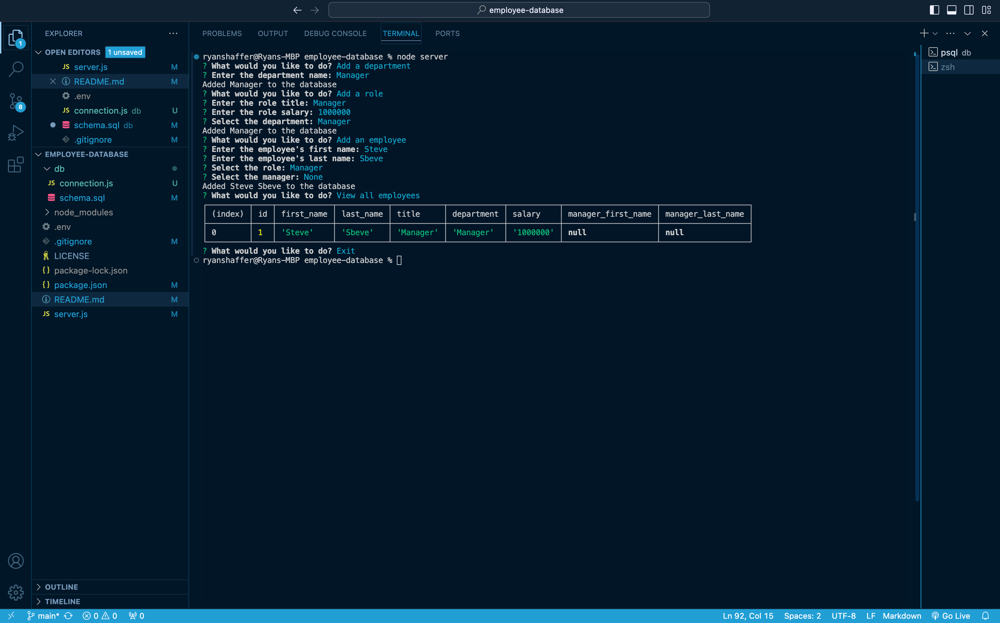
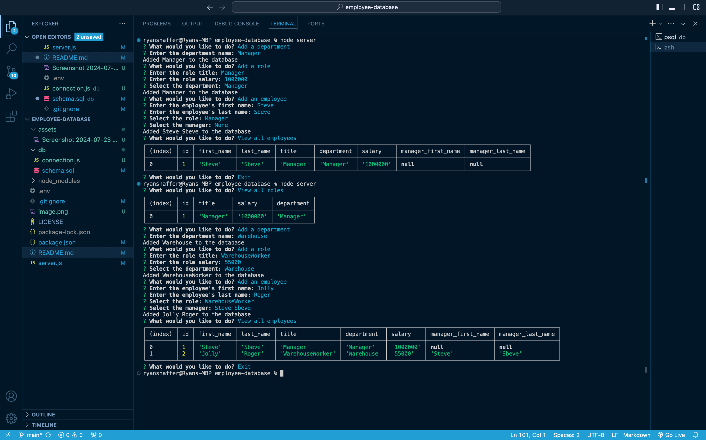

# employee-database

*Note* Code from week 12 challenge readme was referenced/used in this project and is referenced in-project via notes
## Table of contents

- [Your Task](#your-task)
- [User Story](#user-story)
- [Acceptance Criteria](#acceptance-criteria)
- [Challenges](#challenges)
- [Usage](#usage)
- [Contributing](#contributing)
- [Credits](#credits)
- [Contact](#contact)
- [Screenshots](#screenshots)

## Your Task

Developers frequently have to create interfaces that allow non-developers to easily view and interact with information stored in databases. These interfaces are called **content management systems (CMS)**. Your assignment this week is to build a command-line application from scratch to manage a company's employee database, using Node.js, Inquirer, and PostgreSQL.
<br/><br/>
Because this Challenge will require the use of the `Inquirer` package, ensure that you install and use Inquirer version 8.2.4. To do so, use the following command in your project folder: `npm i inquirer@8.2.4`.
<br/><br/>

Because this application won’t be deployed, you’ll also need to create a walkthrough video that demonstrates its functionality and all of the following acceptance criteria being met. You’ll need to submit a link to the video and add it to the README of your project.

## User Story

AS A business owner
I WANT to be able to view and manage the departments, roles, and employees in my company
SO THAT I can organize and plan my business

## Acceptance Criteria

GIVEN a command-line application that accepts user input
<br/><br/>
WHEN I start the application
<br/><br/>
THEN I am presented with the following options: view all departments, view all roles, view all employees, add a department, add a role, add an employee, and update an employee role
<br/><br/>
WHEN I choose to view all departments
<br/><br/>
THEN I am presented with a formatted table showing department names and department ids
<br/><br/>
WHEN I choose to view all roles
<br/><br/>
THEN I am presented with the job title, role id, the department that role belongs to, and the salary for that role
<br/><br/>
WHEN I choose to view all employees
<br/><br/>
THEN I am presented with a formatted table showing employee data, including employee ids, first names, last names, job titles, departments, salaries, and managers that the employees report to
<br/><br/>
WHEN I choose to add a department
<br/><br/>
THEN I am prompted to enter the name of the department and that department is added to the database
<br/><br/>
WHEN I choose to add a role
<br/><br/>
THEN I am prompted to enter the name, salary, and department for the role and that role is added to the database
<br/><br/>
WHEN I choose to add an employee
<br/><br/>
THEN I am prompted to enter the employee’s first name, last name, role, and manager, and that employee is added to the database
<br/><br/>
WHEN I choose to update an employee role
<br/><br/>
THEN I am prompted to select an employee to update and their new role and this information is updated in the database 

## Challenges
This project as a whole was fairly complicated for me. It involved creating multiple functions, and given that the async await functionality is new, it was especially challenging having to implement that so many times over. Additionally, file structure and organization is becoming increasingly difficult, as well as remembering all the different npm packs one needs to install to use.
## Usage
This application can be used by cloning the repo into your desired file location, then opening the project folder in your preferred editor, you'll need to make a .env file with the following credentials 
<br/><br/>
DB_NAME=your_db_name
<br/>
DB_USER=your_user
<br/>
DB_PASSWORD=your_password
<br/>
DB_HOST=localhost
<br/>
DB_DIALECT=your_dialect
<br/><br/>
Additionally, one will need to run the server.js file in the integrated terminal and run npm i to install all the necessary packs for this application. Once that has been done, then it is time to run the schema file followed by the seeds file in a seperate integrated terminal window. Post starting the db and seeding it, go to the server.js int term and run node server. From there you should be prompted to fill out different fields starting with department. *Note* it is imperative you add from department to employee and also according to hierarchy of organization. This will allow this choosing of managers as one creates employees.  

## Contributing
Currently not accpeitng contributions

## Credits
This projerct was constructed by yours truly, and I did have some help from the xpert learning assistant over organizing the SELECT FROM and JOIN bits outlined in the server file. Given how many pieces of data there were for that bit, my brain struggled to keep it all in.

## Contact 
Github: https://github.com/shyanrafer
<br/><br/>
Project repo: https://github.com/shyanrafer/employee-database
<br/><br/>
Captured video: 
<br/><br/>
Email (preferred method of contact): 
```md
ryanshaffer1324@gmail.com
```

## Screenshots


